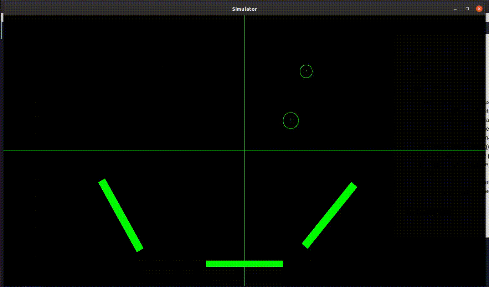

## Syntax

 The detailed syntax for each possible object can be found in the template.sim file

#### Set parameters :

These can be used to set global parameter values.
General Syntax is :
SET param \<or\> SET param value.
<ul>
<li>g : Earth's gravitation. No value can be given. Default built in value is 9.81</li>
<li>G : univeral griavitation. No value can be given. Default is 6.67e-11</li>
<li>em : Electromagnetism. No value can be given. Default Value is 8.99e9</li>
<li>e : Coefficient of Restetution, used only for 'g' simulation. Default is 1. Value can be given.</li>
<li>tslice : A very wiered parameter, it is used as a global time-step, but its value can completely change the path of particleas taken by objects.Value can be given. Default is 0, which means it takes the time-step from system clock.</li>
<li>delay : used to slow down simulation. default is 0,any greater than 0 value will slow down simulation.</li>
</ul>
Only one of 'G' and 'g' can be used.In case both are specified the last one specified will be taken.

#### ADD objects:

genral Syntax is:
ADD OBJ_TYPE
params
ENDBODY

OBJ_TYPES are :

<ul>
<li>MBALL : sphere having mass. params are : x,y,z co-ordinates of centre, radius(r),mass(m), and opetions TRACE, which shows the traced path as well.</li>
<li>QBALL : sphere having Charge. params are : x,y,z co-ordinates of centre, radius(r),charge(q), and opetions TRACE, which shows the traced path as well.</li>
<li>MQBALL : sphere having mass and Chareg. params are : x,y,z co-ordinates of centre, radius(r),mass(m),charge(q) and opetions TRACE, which shows the traced path as well.</li>

<li>MPT,QPT,MQPT which are point objects of above, and do not have radius parameter.</li>
<li>ST_RECT : Static rectangle, does not move and behaves as Earth-like immovable objec in 'g' simulations. params are :
x,y,z co-ordinates of centre,height,width,mass(m), rotation(rot) with respect to +ve x-axis specified in degrees.
</li>
</ul>

## Examples:

#### almost_circle.sim

#### four_body_sim1.sim

#### spiral1.sim

#### spiral2.sim

#### spiral3.sim

#### stat_incorrect.sim

#### stat_with_G.sim

#### static_body_sim1.sim

#### three_body_sim1.sim

#### three_body_sim2.sim

#### three_body_sim3.sim

#### three_body_sim4.sim

